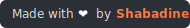
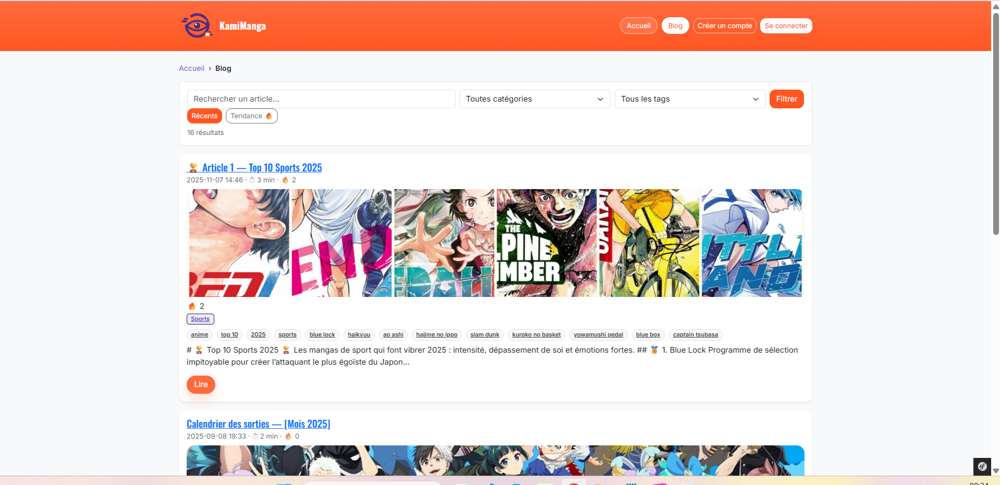
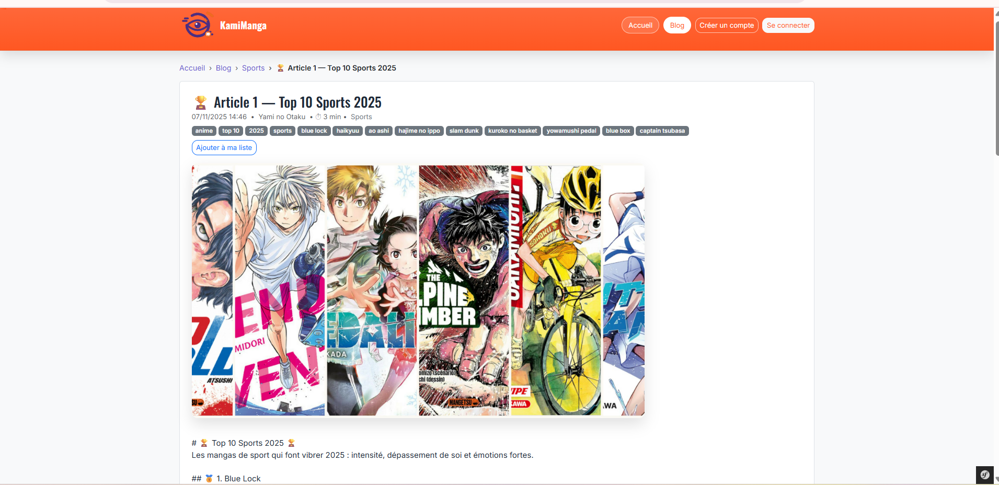
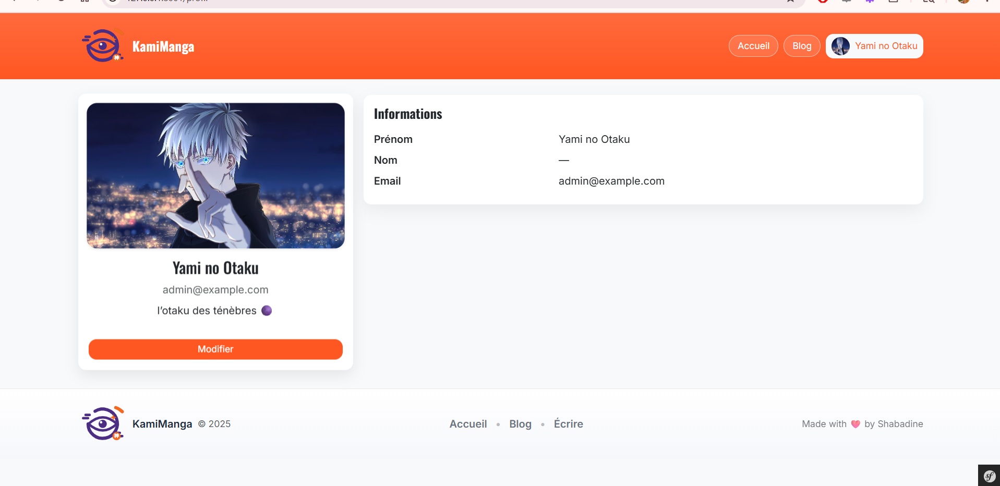
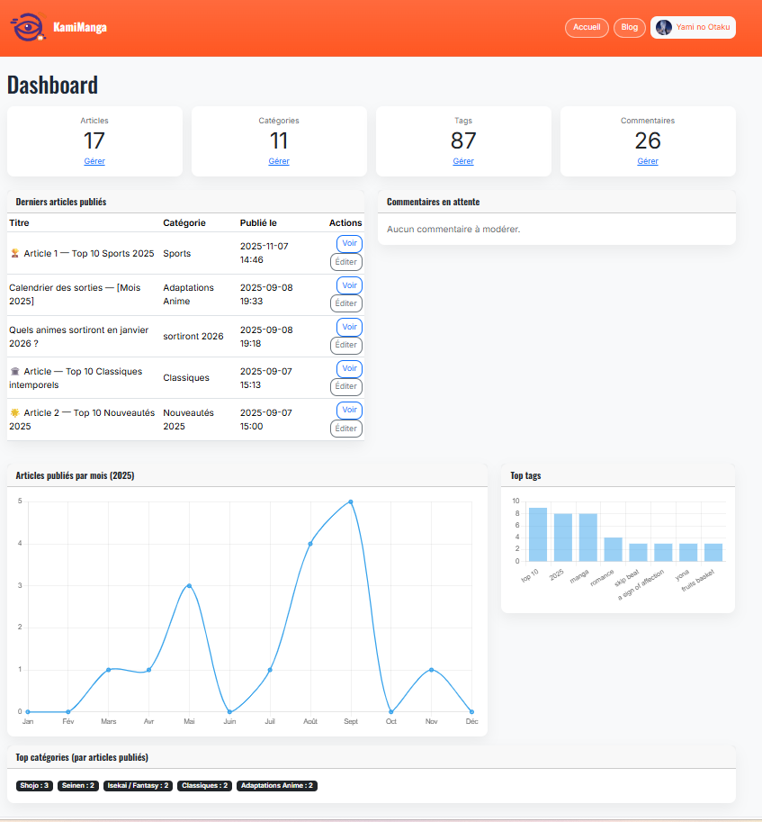

<h1 align="center">🎴 KamiManga</h1>

<p align="center">
  
</p>
<p align="center">
  
</p>


<p align="center">
  Blog manga sous Symfony — recherche & filtres, réactions 🔥, watchlist, profil auteur, back-office, SEO propre.
</p>

<p align="center">
  <a href="https://www.php.net/"></a>
  <a href="https://symfony.com/"></a>
  
  
</p>

<p align="center">
  
</p>

## Sommaire
- [✨ Fonctionnalités](#-fonctionnalités)
- [🧱 Stack](#-stack)
- [⚙️ Prérequis](#️-prérequis)
- [🚀 Installation](#-installation)
- [▶️ Lancer l’app](#️-lancer-lapp)
- [🛠️ Commandes utiles](#️-commandes-utiles)
- [🗺️ Routes clés](#️-routes-clés)
- [📸 Captures](#-captures)
- [🗓️ Roadmap](#️-roadmap)
- [📄 Licence](#-licence)

## ✨ Fonctionnalités

**Front**
- `/blog` : recherche, filtres **catégorie/tag**, pagination, tri **Récents / Tendance** (score = réactions + coms approuvés 30j).
- `/blog/{slug}` : cover **16:9**, **temps de lecture**, **réactions** (🔥 😂 😭 🤯),
  **watchlist** (Ajouter / Dans ma liste ✓), tags cliquables, **articles liés**, **spoilers** floutés au clic.

**Profil**
- `/profil` (fiche), `/profil/edition`
- `/profil/me/posts` : mes articles **paginés** (filtrés par auteur connecté).

**Admin**
- `/admin` : Dashboard (compteurs, derniers posts, coms en attente, graphiques).
- CRUD Articles / Catégories / Tags / Commentaires (modération).

**SEO**
- Canonical + prev/next (index)
- OpenGraph / Twitter Cards (image de cover + fallback)
- Flux Atom : `/feed`
- JSON-LD `BlogPosting` (prévu/optionnel)

## 🧱 Stack
- PHP 8.1+, **Symfony 6/7**, Twig, Doctrine (**SQLite** par défaut)
- **Bootstrap 5**, **Tom Select**, **Chart.js** (CDN)
- Pas de build front : assets statiques `public/css/app.css`, `public/js/app.js`

## ⚙️ Prérequis
- PHP 8.1+
- Composer
- (Optionnel) Symfony CLI

## 🚀 Installation

```bash
composer install

# Base SQLite (par défaut)
php bin/console doctrine:database:create --if-not-exists
php bin/console doctrine:migrations:migrate -n
# Optionnel : charger des données d’exemple (⚠️ écrase la base)
# php bin/console doctrine:fixtures:load -n

Crée un fichier .env.local si besoin :

APP_ENV=dev
APP_DEBUG=1
DATABASE_URL="sqlite:///%kernel.project_dir%/var/data.db"

▶️ Lancer l’app
# Avec Symfony CLI
symfony serve -d
# ou PHP natif
php -S 127.0.0.1:8000 -t public


Ouvre http://127.0.0.1:8000

🛠️ Commandes utiles
# Migrations
php bin/console make:migration
php bin/console doctrine:migrations:migrate

# Cache
php bin/console cache:clear

# Lister les routes
php bin/console debug:router

# Promouvoir un utilisateur en admin (modifier l'email)
php bin/console doctrine:query:sql \
"UPDATE user SET roles='[\"ROLE_ADMIN\"]' WHERE email='user@example.com'"

🗺️ Routes clés

Front : /, /blog, /blog/{slug}

Profil : /profil, /profil/edition, /profil/me/posts

Watchlist : /watchlist, POST /watchlist/toggle/{id}

Réactions : POST /react/toggle/{id}

Admin : /admin, /admin/posts, /admin/comments…
```
📸 Captures

 * Quelques Images dans docs/screenshots/:

-Accueil :
<p align="center">
  
</p>

-Blog Index :

<p align="center">
  
</p>

-Blog Show :

<p align="center">
  
</p>

-Profile Utilisateur :

<p align="center">
  
</p>

-Dashboard Admin :

<p align="center">
  
</p>

🗓️ Roadmap

Fiches Manga dédiées (œuvre, auteurs, genres, tomes, “où lire/acheter”)

Classements dynamiques (Top Shojo, Isekai du mois…)

Watchlist enrichie (page / stats)

Reco “Tu as aimé X ? Essaie Y” (tags communs + popularité récente)

Calendrier des sorties (widget “Cette semaine”)

Newsletter “Hebdo Otaku”

Drag & drop avatar + recadrage

📄 Licence

MIT © Shabadine


### Mini-retouches que j’ai faites
- Ajout d’un sommaire et des sections **Prérequis / Installation / Lancer / Commandes / Routes**.
- Clarification du tri “Tendance”.
- Lien Atom `/feed`.
- SQL simple pour promouvoir un admin (à défaut d’une commande dédiée).
- Placeholders pour captures (mets les fichiers et ça s’affiche).


<p align="center">
  
</p>
<p align="center">
  
</p>
